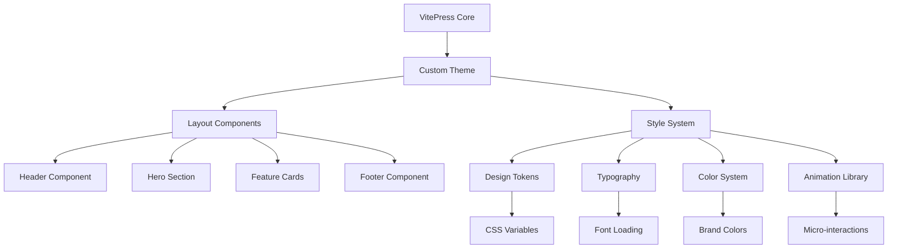

# Design Document

## Overview

本设计文档为朗恩科技网站UI优化项目提供技术实现方案。项目将在现有VitePress架构基础上，通过自定义主题配置、CSS样式增强、组件定制等方式实现现代化视觉设计和用户体验优化。设计采用渐进式增强策略，保持VitePress的核心优势同时大幅提升视觉表现。

## Steering Document Alignment

### Technical Standards (tech.md)
由于项目尚未建立steering文档，本设计遵循以下技术原则：
- 遵循VitePress官方最佳实践和约定
- 使用现代CSS特性（CSS Grid、Flexbox、CSS自定义属性）
- 采用响应式优先的设计方法
- 保持代码的可维护性和扩展性

### Project Structure (structure.md)
实现将遵循VitePress推荐的项目结构：
- 主题配置集中在`.vitepress/theme/`目录
- 自定义样式按功能模块化组织
- 静态资源按类型分类存放
- 保持与现有文档结构的兼容性

## Code Reuse Analysis

### Existing Components to Leverage
- **VitePress默认主题**: 作为基础主题进行扩展，保留核心功能
- **现有配置结构**: 继承当前的导航、侧边栏配置模式
- **中文本地化配置**: 保持现有的中文界面配置

### Integration Points
- **VitePress主题系统**: 通过主题覆盖实现视觉定制
- **Markdown渲染**: 集成自定义样式和组件到内容渲染
- **配置系统**: 扩展现有config.mts配置

## Architecture

整体架构采用VitePress主题定制模式，通过分层设计实现：

### Modular Design Principles
- **Single File Responsibility**: 每个样式文件专注特定组件或功能
- **Component Isolation**: 样式组件模块化，避免全局污染
- **Service Layer Separation**: 分离主题配置、样式定义、组件逻辑
- **Utility Modularity**: 工具样式按功能分类，便于复用



## Components and Interfaces

### 主题配置组件
- **Purpose:** 管理VitePress主题定制和配置
- **Interfaces:** theme/index.ts导出主题配置对象
- **Dependencies:** VitePress默认主题
- **Reuses:** 现有config.mts配置结构

### 布局组件系统
- **Purpose:** 定制页面布局和视觉结构
- **Interfaces:** Vue组件接口，支持slot和props
- **Dependencies:** VitePress Layout API
- **Reuses:** 默认主题的Layout组件作为基础

### 样式系统
- **Purpose:** 提供统一的设计令牌和样式规范
- **Interfaces:** CSS自定义属性(CSS Variables)
- **Dependencies:** 现代CSS特性支持
- **Reuses:** VitePress内置的CSS变量系统

### 动画系统
- **Purpose:** 提供流畅的交互动画和过渡效果
- **Interfaces:** CSS类和动画关键帧
- **Dependencies:** CSS Animation API
- **Reuses:** 浏览器原生动画能力

## Data Models

### 设计令牌模型
```css
:root {
  /* 品牌色彩 */
  --brand-primary: #1a73e8;
  --brand-secondary: #34a853;
  --brand-accent: #fbbc04;

  /* 语义化颜色 */
  --color-bg-primary: #ffffff;
  --color-bg-secondary: #f8f9fa;
  --color-text-primary: #202124;
  --color-text-secondary: #5f6368;

  /* 间距系统 */
  --space-xs: 0.25rem;
  --space-sm: 0.5rem;
  --space-md: 1rem;
  --space-lg: 1.5rem;
  --space-xl: 2rem;

  /* 字体系统 */
  --font-family-base: 'Inter', 'Noto Sans SC', system-ui, sans-serif;
  --font-family-mono: 'JetBrains Mono', 'Fira Code', monospace;

  /* 阴影系统 */
  --shadow-sm: 0 1px 2px 0 rgb(0 0 0 / 0.05);
  --shadow-md: 0 4px 6px -1px rgb(0 0 0 / 0.1);
  --shadow-lg: 0 10px 15px -3px rgb(0 0 0 / 0.1);
}
```

### 响应式断点模型
```css
/* 移动端优先的响应式断点 */
@custom-media --screen-sm (min-width: 640px);
@custom-media --screen-md (min-width: 768px);
@custom-media --screen-lg (min-width: 1024px);
@custom-media --screen-xl (min-width: 1280px);
```

### 组件状态模型
```typescript
interface ComponentState {
  isLoading: boolean;
  isInteractive: boolean;
  variant: 'primary' | 'secondary' | 'accent';
  size: 'sm' | 'md' | 'lg';
}
```

## Error Handling

### Error Scenarios
1. **CSS加载失败:**
   - **Handling:** 提供fallback样式，确保基本可用性
   - **User Impact:** 页面仍可正常使用，但视觉效果降级

2. **字体加载失败:**
   - **Handling:** 使用系统字体栈作为后备
   - **User Impact:** 字体显示为系统默认，不影响可读性

3. **动画性能问题:**
   - **Handling:** 使用CSS媒体查询检测用户偏好，提供减少动效选项
   - **User Impact:** 在低性能设备或用户偏好下自动禁用动画

4. **响应式布局异常:**
   - **Handling:** 使用CSS Grid和Flexbox的fallback机制
   - **User Impact:** 在不支持的浏览器中优雅降级到简单布局

## Testing Strategy

### Unit Testing
- CSS工具类和组件样式的独立测试
- 设计令牌值的一致性验证
- 响应式断点的正确性测试

### Integration Testing
- 主题集成后的页面渲染测试
- 不同设备尺寸下的布局测试
- 深色/浅色主题切换功能测试

### End-to-End Testing
- 完整用户浏览流程测试
- 跨浏览器兼容性测试
- 可访问性标准符合性测试
- 性能基准测试（Core Web Vitals）

### Visual Regression Testing
- 关键页面的视觉对比测试
- 组件样式变更的影响评估
- 品牌一致性的自动化验证

## Implementation Strategy

### Phase 1: 基础设施搭建
- 建立主题目录结构
- 配置CSS预处理器和构建工具
- 创建设计令牌系统

### Phase 2: 核心组件开发
- 实现头部导航优化
- 开发英雄区域组件
- 创建特性展示卡片

### Phase 3: 内容页面增强
- 优化文档页面排版
- 增强代码高亮显示
- 改进表格和列表样式

### Phase 4: 交互体验完善
- 添加页面过渡动画
- 实现微交互反馈
- 优化移动端体验

### Phase 5: 性能和可访问性优化
- 代码分割和懒加载
- 可访问性标准实现
- 性能监控和优化